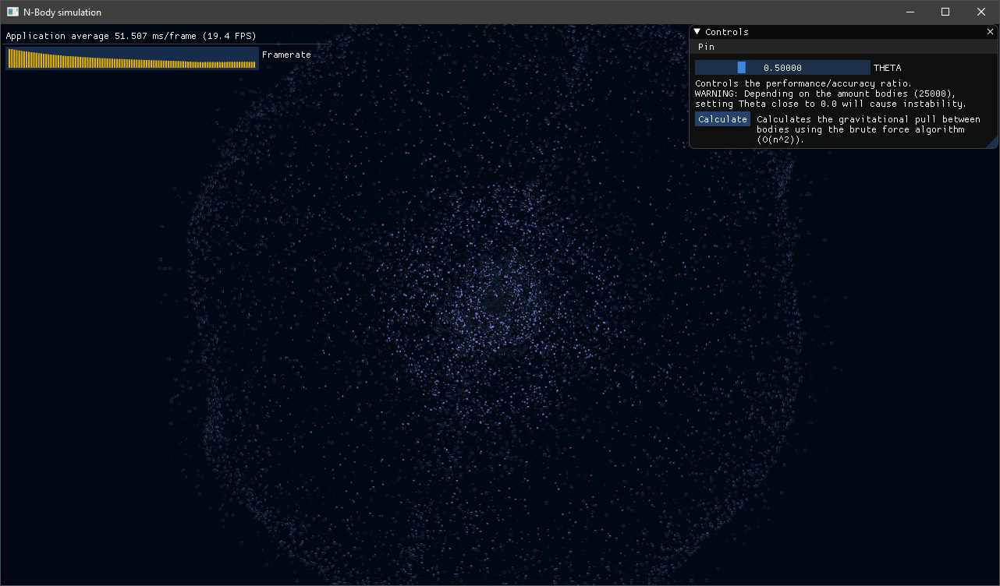
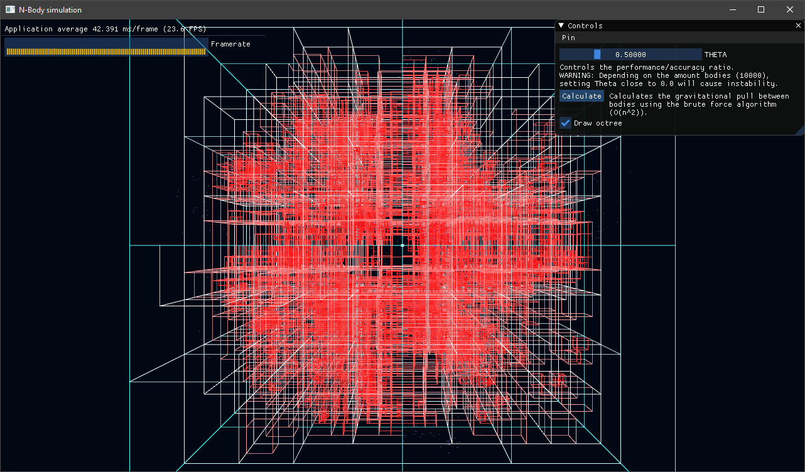
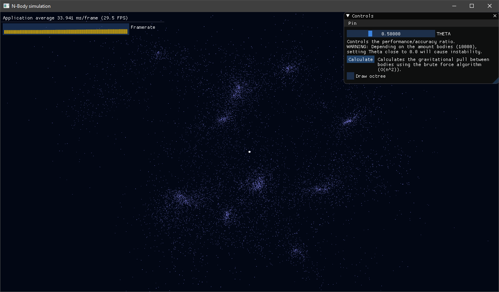

# N-Body-simulation
A WIP C++ and modern OpenGL n-body problem simulation.
It utilizes the [Barnes-Hut](https://en.wikipedia.org/wiki/Barnes%E2%80%93Hut_simulation) algorithm to compute interactions between bodies.

The simulation running with 25000 bodies, θ = 0.5 and 4 threads:

Visualization of the Barnes-Hut algorithm:

Formations of bodies:

